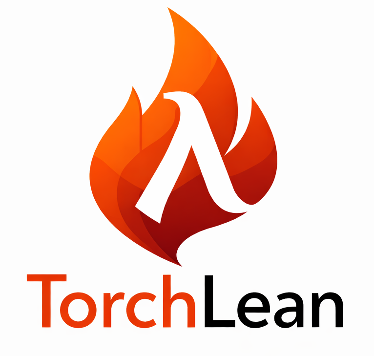

<h1 align="center">
  
  Gondlin — Formalizing Neural Networks in Lean
</h1>

Gondlin is a Lean 4 framework for writing, running, inspecting, and verifying
neural-network programs. It provides typed tensors and model APIs, a shared
graph IR, runtime and autograd support, finite-precision semantics, certificate
checkers, a CUDA boundary, and examples across modern ML and scientific ML.

This README is the quick entry point — build the repo, run the first examples,
locate the docs, and find citation info.

## Quickstart

```bash
git clone https://github.com/nktkt/gondlin.git
cd gondlin
lake build
lake exe gondlin mlp --cpu --steps 10
```

Gondlin is pinned by `lean-toolchain` and currently builds with
`leanprover/lean4:v4.29.0`. The current Gondlin package version is `v0.1.0`;
see [`CHANGELOG.md`](CHANGELOG.md) for release notes.

## First Things To Try

```bash
lake exe gondlin --help
lake exe verify --help
lake exe verify -- gondlin-ibp
```

For the maintained example surface:

```bash
lake build NN.Examples.Zoo
```

## Documentation

The hosted docs site is not deployed for this private repository; browse the
in-repo sources instead:

- Project website source: [`home_page/`](home_page/) (Jekyll; preview locally
  with `bundle exec jekyll serve` from that directory).
- Guide source: [`blueprint/GondlinBlueprint/Guide/`](blueprint/GondlinBlueprint/Guide/)
  (Verso-Blueprint; build locally with `cd blueprint && lake build blueprint-gen`).
- API reference: generate locally with `lake build NN:docs`; output lands under
  `.lake/build/doc/`.
- Trust and correctness notes: [`TRUST_BOUNDARIES.md`](TRUST_BOUNDARIES.md),
  [`AI_USAGE.md`](AI_USAGE.md), [`THIRD_PARTY_NOTICES.md`](THIRD_PARTY_NOTICES.md),
  [`CONTRIBUTING.md`](CONTRIBUTING.md).

If GitHub Pages is enabled for this repository in the future, the published URLs
will be `https://nktkt.github.io/gondlin/` for the site,
`https://nktkt.github.io/gondlin/blueprint/` for the guide, and
`https://nktkt.github.io/gondlin/docs/` for the API reference.

## Use Gondlin From Another Lean Project

Gondlin is a normal Lake package. You can depend on the Git repository directly:

```lean
require Gondlin from git "https://github.com/nktkt/gondlin.git" @ "main"
```

Then run:

```bash
lake update
lake exe cache get
lake build
```

Most downstream model and training files should start from the public facade:

```lean
import NN.API.Public
```

Use the broader umbrella when you want the maintained specification, IR, proof,
verification, examples, and widget surface:

```lean
import NN.Library
```

For local development against a checkout, use a path dependency instead:

```lean
require Gondlin from "../gondlin"
```

## Repository Map

- `NN/API` — public facade for model, tensor, data, and training workflows.
- `NN/Spec` — mathematical tensor, layer, model, and dynamical-system definitions.
- `NN/Runtime` — executable autograd, optimizers, training loops, CUDA boundary,
  PyTorch import/export, and RL runtime support.
- `NN/IR` and `NN/GraphSpec` — graph IR, graph semantics, and typed architecture
  descriptions.
- `NN/Proofs` — tensor algebra, autograd correctness, analytic derivatives,
  runtime approximation, and bridge proofs.
- `NN/Floats` — finite-precision models, IEEE-style executable semantics,
  NeuralFloat formats, and error-bound infrastructure.
- `NN/MLTheory` — learning theory, robustness, CROWN/LiRPA, generative
  objectives, optimization theory, and related proof layers.
- `NN/Verification` — certificate checkers and CLI workflows.
- `NN/Examples` — quickstarts, model zoo commands, widgets, verification
  fixtures, and interoperability demos.
- `blueprint/GondlinBlueprint/Guide` — source for the public guide.
- `home_page` — project website sources.

## Correctness and Boundaries

For correctness claims, trust assumptions, and third-party tooling, see:

- `TRUST_BOUNDARIES.md`
- `AI_USAGE.md`
- `THIRD_PARTY_NOTICES.md`
- `CONTRIBUTING.md`

Lean proofs, executable checkers, Lake builds, tests, and explicit
trust-boundary documentation are the source of truth for what is proved,
checked, or assumed.

## License

Gondlin is released under the MIT License. See `LICENSE`.
